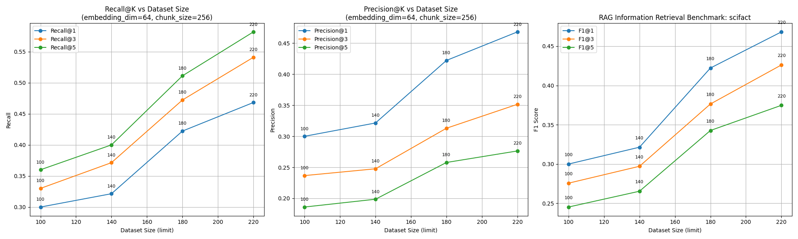
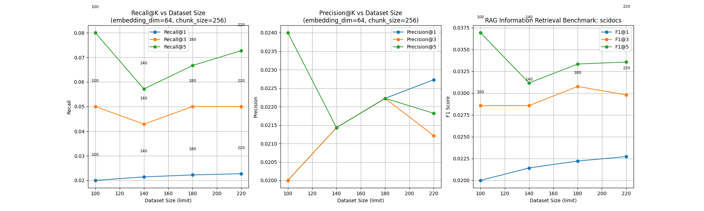
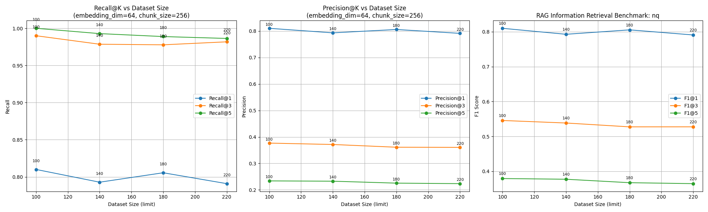

# Benchmarking Retrieval with configurable Beir datasets, limits

This benchmark uses the [beir-cellar/beir](https://github.com/beir-cellar/beir) library for accessing datasets, queries and answers and is used for testing Llama Stack's retieval capabilities with different Vector DB providers. 

*NOTE:* Please install the current project before testing this benchmark

## Usage
Run the script with:
```
# Default usage benchmarks faiss against the "scifact" dataset with limits [100, 140, 180, 220]
uv run python dev/bench_with_beir.py

# Passing arguments to select db provider, list of datasets and limits
uv run python dev/bench_with_beir.py --vector_db_id sqlite-vec --datasets "scifact" "nq" "scidocs" --limits 100 140 180 220
```

## Charts
### Sqlite Vec Benchmarks
#### Scifact Dataset


#### Scidocs Dataset


#### NQ Dataset


### FAISS Benchmarks
#### Scifact Dataset


#### Scidocs Dataset


#### NQ Dataset
